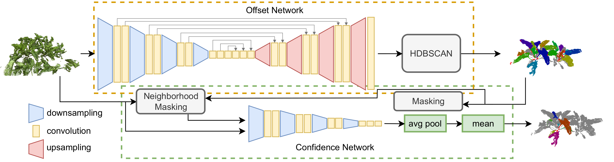

# High Precision Leaf Instance Segmentation for Phenotyping in Point Clouds Obtained Under Real Field Conditions

This repo contains the code for our publication "High Precision Leaf Instance Segmentation for Phenotyping
in Point Clouds Obtained Under Real Field Conditions". The paper can be downloaded **[here](https://www.ipb.uni-bonn.de/wp-content/papercite-data/pdf/marks2023ral.pdf)**.



## Setup
- Install docker and nvidia-docker2 on your machine
- Clone this repo to a folder on your pc
- Edit ```docker-compose.yml``` to set ```/data``` and ```/logs``` paths. ```/data``` contains the dataset and ```/logs``` is the folder where the tensorboard logs will be saved.
- Execute ```make build```
- Get a coffee and wait

## Train
- Execute ```make train_instances``` to train the segmentation network

## Test
- Execute ```make test_instances``` to evaluate the segmentation network

# Citation

If you use this repo, please cite us :

```
@article{marks2023ral,
    author={Marks, Elias and Sodano, Matteo and Magistri, Federico and Wiesmann, Louis and Desai, Dhagash and Marcuzzi, Rodrigo and Behley, Jens and Stachniss, Cyrill},
    journal={IEEE Robotics and Automation Letters},
    title={High Precision Leaf Instance Segmentation for Phenotyping in Point Clouds Obtained Under Real Field Conditions},
    year={2023},
    volume={8},
    number={8},
    pages={4791-4798},
    doi={10.1109/LRA.2023.3288383}}